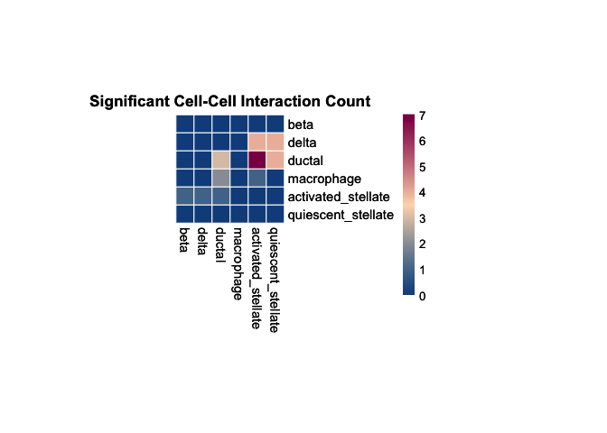
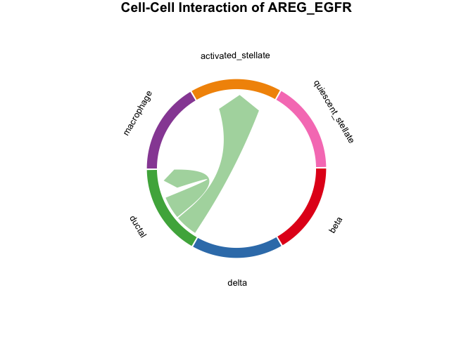
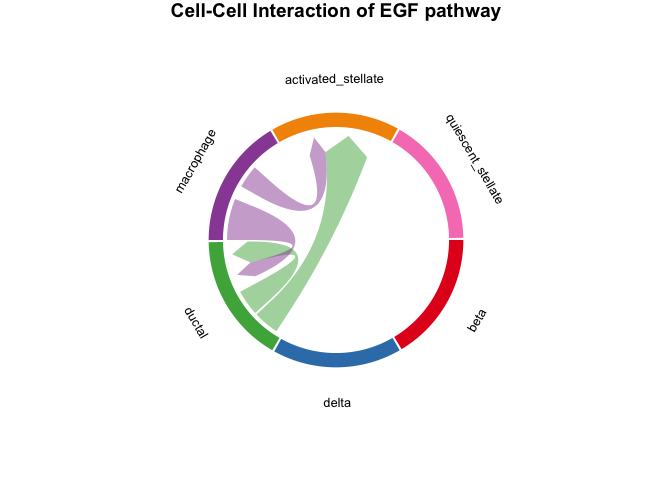
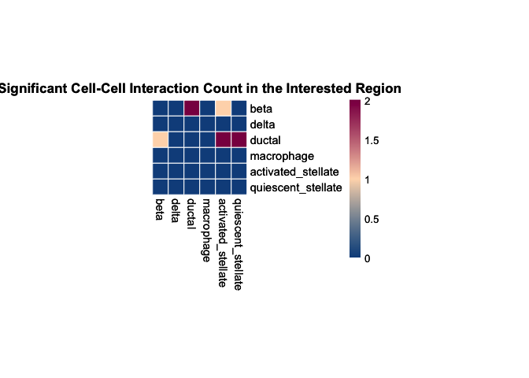
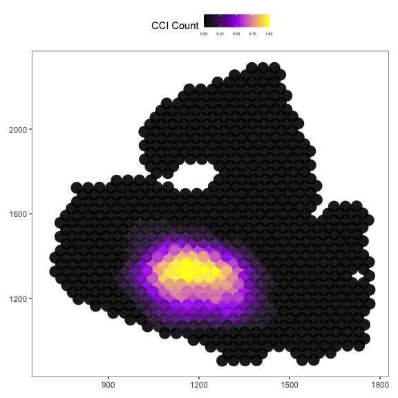

## Introduction

This tutorial demonstrates how to use the SpaCCI package for analyzing
spatial cell-cell interactions using an example of spot-level datasets.

### Part I: Data Input, Processing and Initialization.

We first load the SpaCCI package:

    library(SpaCCI)

Please still load the `Tutorial_example_data.rda` for getting the `interest_region_Spot_IDs` for regional analysis section.

    load(system.file("extdata", "Tutorial_example_data.rda", package = "SpaCCI"))

#### Prepare required input data for SpaCCI analysis

Below, we demonstrate how to prepare these datasets using the example
data provided in the <a href="https://litingku.github.io/SpaCCI/datas/data_download/"> Data Section</a>.

###### (A) Normalized gene expression data frame

    # Read normalized spot-level gene expression data.
    normalized_gene_spot_df <- read.csv("~/normalized_gene_spot_df.csv")
    # Make the gene names be the row names
    rownames(normalized_gene_spot_df) <- normalized_gene_spot_df$X
    # Make the column name contains only spot IDs
    normalized_gene_spot_df <- normalized_gene_spot_df[,-1]

  
###### (B) Prepare the cell type proportion data frame.

    # Read spot-level cell type proportion data.
    cell_prop_df <- read.csv("~/cell_prop_df.csv")
    # Make the spot IDs be the row names
    rownames(cell_prop_df) <- cell_prop_df$X
    # Make the column names contains only cell type names
    cell_prop_df <- cell_prop_df[,-1]

###### (C) Prepare the spatial coordinates data frame.

    # Read spot-level spatial coordinates data.
    cell_prop_df <- read.csv("~/spatial_coords_df.csv")
    # Make the spot IDs be the row names
    rownames(spatial_coords_df) <- spatial_coords_df$X
    
    # Make the column names contains `c("imagerow","imagecol")`
    # If your spatial coordinates are `c("x","y")`, 
    # then PLEASE rename to `c("imagecol","imagerow")`
    # If your spatial coordinates are `c("y","x")`, 
    # then PLEASE rename to `c("imagerow","imagecol")`
    
    spatial_coords_df <- spatial_coords_df[,-1]

###### (D) Ensure consistency between all the three data frames.

    # Check that the spot IDs in `cell_prop_df` and `spatial_coords_df` match the column names in `normalized_gene_spot_df`.
    stopifnot(setdiff(rownames(cell_prop_df), colnames(normalized_gene_spot_df)) == character(0))
    stopifnot(setdiff(rownames(spatial_coords_df), colnames(normalized_gene_spot_df)) == character(0))
    stopifnot(setdiff(rownames(spatial_coords_df), rownames(cell_prop_df)) == character(0))

    # The above checks confirm that the spot IDs are consistent across the gene expression and cell type proportion data frames,
    # ensuring they are ready for SpaCCI analysis.

    # If not then we make them the same
    colnames(normalized_gene_spot_df) <- rownames(cell_prop_df)
    
Now we have prepared the data for SpaCCI analysis.

### Part II: Access the Ligand-Receptor Interaction Database

We identify possible Ligand-Receptor interactions that might happen on
the tissue slides according to the gene expression data.

    # Identify Possible Ligand-Receptor Pairs for Cell-Cell Communication
    # Specifying the species ("Human" or "Mouse").
    # Database options include "CellChat", "CellPhoneDB", "Cellinker", "ICELLNET", and "ConnectomeDB".
    # We use the cellchat database, for more information, run '? LR_database' .
    LRDB <- LR_database("Human", "CellChat", normalized_gene_spot_df)

### Part III: Inferring Cell-Cell Interaction Analysis

#### (A) Global analysis

Here we first run the global analysis on the whole slide, and plot the
overall results using heatmap.

    ####### global analysis. ###########
    # ?run_SpaCCI
    result_global <- run_SpaCCI(gene_spot_expression_dataframe = normalized_gene_spot_df,
                                 spot_cell_proportion_dataframe = cell_prop_df,
                                 spatial_coordinates_dataframe = spatial_coords_df,
                                 LR_database_list = LRDB,
                                 analysis_scale = "global")

    ## [1] "writing data frame"

    # ?plot_SpaCCI_heatmap
    # plot the result heatmap, we set the significant cutoff alpha = 0.05,
    # If you want the details on the heatmap, please specify return_tables = TRUE.
    p <- plot_SpaCCI_heatmap(SpaCCI_Result_List = result_global,
                        symmetrical = FALSE, cluster_cols = FALSE, return_tables = FALSE,
                        cluster_rows = FALSE, cellheight = 15, cellwidth = 15,
                        specific_celltypes = c(colnames(cell_prop_df)), alpha = 0.05,
                        main= "Significant Cell-Cell Interaction Count")
    print(p)

Then we could plot the chord Diagram by specifying specific
Ligand-Receptor pair or Pathway name.

-   **NOTE**: When specifying specific Ligand-Receptor pair or Pathway
    name please check the `result_global$pvalue_df` for the details on
    Ligand-Receptor pair and Pathway name.

<!-- -->

    # plot the result with chordDiagram while selecting specific Ligand-Receptor pair name
    plot_SpaCCI_chordDiagram(SpaCCI_Result_List = result_global,
                             specific_celltypes = c(colnames(cell_prop_df)),
                             L_R_pair_name  = "AREG_EGFR")

    # plot the result with chordDiagram while selecting specific pathway name
    plot_SpaCCI_chordDiagram(SpaCCI_Result_List = result_global,
                      specific_celltypes = c(colnames(cell_prop_df)),
                      pathway_name  = "EGF")

#### (B) Regional analysis

Here we run the regional analysis on the whole slide with selected
`interest_region_Spot_IDs`, and plot the overall results using heatmap.

    # regional analysis
    result_regional <- run_SpaCCI(gene_spot_expression_dataframe = normalized_gene_spot_df,
                                spot_cell_proportion_dataframe = cell_prop_df,
                                spatial_coordinates_dataframe = spatial_coords_df,
                                LR_database_list = LRDB,
                                analysis_scale = "regional",
                                region_spot_IDs = interest_region_Spot_IDs)

    ## [1] "writing data frame"

    # plot the result heatmap
    plot_SpaCCI_heatmap(SpaCCI_Result_List = result_regional,
                        symmetrical = FALSE, cluster_cols = FALSE, return_tables = FALSE,
                        cluster_rows = FALSE, cellheight = 15, cellwidth = 15,
                        specific_celltypes = c(colnames(cell_prop_df)), alpha = 0.05,
                        main= "Significant Cell-Cell Interaction Count in the Interested Region")

#### (C) Local analysis

Finally we run the local analysis on the whole slide with specifying
`specific_LR_pair`.

    # local analysis
    result_local <- run_SpaCCI(gene_spot_expression_dataframe = normalized_gene_spot_df,
                               spot_cell_proportion_dataframe = cell_prop_df,
                               spatial_coordinates_dataframe = spatial_coords_df,
                               LR_database_list = LRDB,
                               specific_LR_pair = "EDN2_EDNRA",
                               analysis_scale = "local",
                               local_scale_proportion = 1,
                               neighborhood_radius = 2.5)

    ## [1] "Now analyzing localized detection using 100% of spots in the whole slide, with a radius of 2.5."

Then we plot the localized plot to access the local signalling hotspot.

    # Please use the spatial_coords_df
    plot_SpaCCI_local(spatial_coordinates_dataframe = spatial_coords_df,
                      SpaCCI_local_Result_List = result_local,
                      Ligand_cell_type = "ductal",
                      Receptor_cell_type = "activated_stellate",
                      spot_plot_size = 6)

    ## [1] "plotting using image spatial coordinates"

