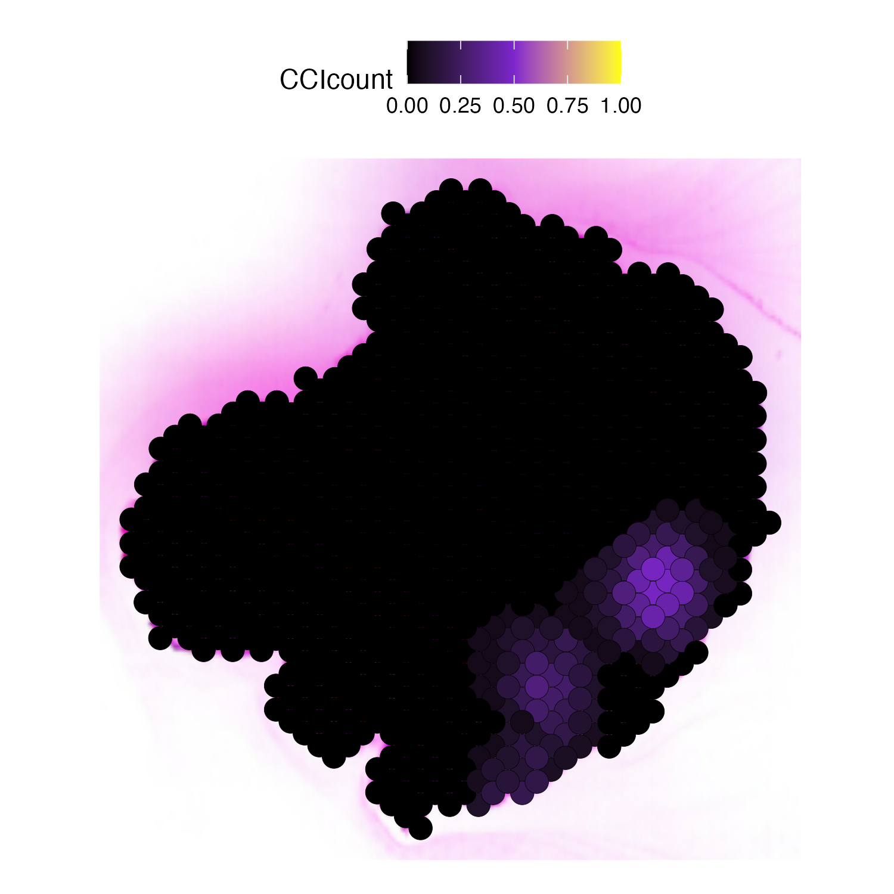

## Introduction

This tutorial demonstrates how to use the SpaCCI package for analyzing
spatial cell-cell interactions using an 10X Visium
dataset.

### Part I: Data Input, Processing and Initialization.

Here we demonstrate using using the 10X Visium dataset: patient LG_3 from 

<a href="https://www.ncbi.nlm.nih.gov/geo/query/acc.cgi?acc=GSE233254"> GSE233254</a>: Contains the 10X Visium data.

<a href="https://www.ncbi.nlm.nih.gov/geo/query/acc.cgi?acc=GSE233293"> GSE233293</a>: Contains the RCTD(Robust Cell Type Deconvolution) of the 10X Visium data.

from <a href="https://doi.org/10.1158/2159-8290.CD-22-1200"> Sans M, Makino Y, Min J, et al. Spatial Transcriptomics of Intraductal Papillary Mucinous Neoplasms of the Pancreas Identifies NKX6-2 as a Driver of Gastric Differentiation and Indolent Biological Potential. Cancer Discov. 2023;13(8):1844-1861. doi:10.1158/2159-8290.CD-22-1200</a>

We first load the package, we will read the 10X Visium data using Seurat.

    library(SpaCCI)
    library(Seurat)
    # Load the 10X Visium data
    LG3 <- Load10X_Spatial( data.dir = "/Users/lku/Desktop/CCI/data/LG3", # please change to your data directory
                            filename = "GSM7421782_LG_3_filtered_feature_bc_matrix.h5",
                            assay = "Spatial",
                            slice = "slice1",
                            filter.matrix = TRUE,
                            to.upper = FALSE,
                            image = NULL)
    

#### Prepare required input data for SpaCCI analysis

SpaCCI requires two main input datasets:

1.  **Gene Expression Data**: A spot-level data frame with genes as row
    names and spot IDs as column names.
2.  **Cell Type Proportion Data**: A spot-level data frame with spot IDs
    as row names and cell type labels as column names.

Below, we demonstrate how to prepare these datasets using the the 10X Visium data `LG3`.

###### (A) Normalize the Seurat data and extract the gene expression data frame

    # Normalize the Seurat object, we use the SCT transform from Seurat
    LG3 <- SCTransform(LG3, assay = "Spatial", verbose = FALSE)

    # Extract the gene expression data frame.
    sct_data <- LG3[["SCT"]]@data # this is the spot-level gene expression data
    gene_spot_df <- as.data.frame(sct_data)
    gene_spot_df[is.na(gene_spot_df)] <- 0
    gene_spot_df <- gene_spot_df[rowSums(gene_spot_df[] )>0,] # we eliminated those genes without any expression

###### (B) Prepare the cell type proportion data frame.

Here because the orignal RCTD contains too many cell types, to make the inference better, we collected some sub cell types into major cell types. (we recommend to analyze using 5-10 cell types).

    # We first read the RCTD data
    RCTD <- readRDS("/Users/lku/Downloads/GSE233293_All_RCTD.final.rds")
    cell_prop_df <- RCTD@meta.data
    cell_prop_df <- cell_prop_df[which(cell_prop_df$Code == "LG_3"),] # select the proportion in patient LG_3
    
    # collected some sub cell types into major cell types
    cell_prop_df$B.cell <- rowSums(cell_prop_df[,c("B.activated" ,   "B.general"  ,    "B.memory"    ,   "B.naive")])  
    cell_prop_df$NK.cell <- rowSums(cell_prop_df[,c("CD16.NK", "CD56.NK", "NK.general", "NK.T")])
    cell_prop_df$DCs.cell <- rowSums(cell_prop_df[,c("DC1", "DC2.3", "pDC")])
    cell_prop_df$T.cell <- rowSums(cell_prop_df[,c("Effector.CD8.T", "Memory.CD4T", "Memory.CD8T", "Naive.CD4.T", "Naive.CD8.T", "T.general", "Treg", "Trem", "IFN.response.T", "MAIT")])
    cell_prop_df$Endothelial.cell <- cell_prop_df[,c("Endothelial")]
    cell_prop_df$Epithelial.cell <- cell_prop_df[,c("Epithelial.")]
    cell_prop_df$Fibroblast.cell <- cell_prop_df[,c("Fibroblast")]
    cell_prop_df$Myeloid.cell <- rowSums(cell_prop_df[,c("mac1", "mac2","mono1", "mono2","Myeloid.gen")])
    cell_prop_df$mast.cell <- cell_prop_df[,c("mast")]
    cell_prop_df$plasma.cell <- cell_prop_df[,c("plasma")]

    # keep the major cell types 
    cell_prop_df <- cell_prop_df[,(36:45)]

###### (C) Ensure consistency between the Seurat object and the data frames.

    # Since cell_prop_df has different format of spot IDs, we made them the same format as in gene_spot_df using:
    t <- c()
    for( i in 1:nrow(cell_prop_df)){
      a <- unlist(strsplit(rownames(cell_prop_df)[i] ,"_"))[1]
      t <- c(t,a)
    }

    # The row names of `cell_prop_df` should be set to the spot IDs.
    rownames(cell_prop_df) <- t
    cell_prop_df[is.na(cell_prop_df)] <- 0
    
    # Check that the spot IDs in `cell_prop_df` match the column names in `gene_spot_df` and `LG3`.
    stopifnot(setdiff(rownames(cell_prop_df), colnames(gene_spot_df)) == character(0))
    stopifnot(setdiff(rownames(cell_prop_df), colnames(LG3)) == character(0))
    

    # The above checks confirm that the spot IDs are consistent across the gene expression and cell type proportion data frames,
    # ensuring they are ready for SpaCCI analysis.

#### Prepare the spatial coordinates.

    # Directly use the `GetTissueCoordinates` function as follows:
    spatial_coords_df <- GetTissueCoordinates(LG3, image = "slice1")

    # Check the final structure of the `spatial_coords_df` to ensure it has 
    # columns "imagecol", "imagerow", and "Spot_ID", with "Spot_ID" as row names
    

### Part II: Access the Ligand-Receptor Interaction Database

We identify possible Ligand-Receptor interactions that might happen on
the tissue slides according to the gene expression data.

    # Identify Possible Ligand-Receptor Pairs for Cell-Cell Communication
    # Specifying the species ("Human" or "Mouse").
    # Database options include "CellChat", "CellPhoneDB", "Cellinker", "ICELLNET", and "ConnectomeDB".
    # We use the cellchat database, for more information, run '? LR_database' .
    LRDB <- LR_database("Human", "CellChat", gene_spot_df)

### Part III: Inferring Cell-Cell Interaction Analysis

#### (A) Global analysis

Here we first run the global analysis on the whole slide, and plot the
overall results using heatmap.

    ####### global analysis. ###########
    # ?run_SpaCCI
    result_global <- run_SpaCCI(gene_spot_expression_dataframe = gene_spot_df,
                                 spot_cell_proportion_dataframe = cell_prop_df,
                                 spatial_coordinates_dataframe = spatial_coords_df,
                                 LR_database_list = LRDB,
                                 analysis_scale = "global")

    ## [1] "writing data frame"

    # ?plot_SpaCCI_heatmap
    # plot the result heatmap, we set the significant cutoff alpha = 0.05
    p <- plot_SpaCCI_heatmap(SpaCCI_Result_List = result_global,
                        symmetrical = FALSE, cluster_cols = FALSE, return_tables = FALSE,
                        cluster_rows = FALSE, cellheight = 15, cellwidth = 15,
                        specific_celltypes = c(colnames(cell_prop_df)), alpha = 0.05,
                        main= "Significant Cell-Cell Interaction Count")
    print(p)

Then we could plot the chord Diagram by specifying specific
Ligand-Receptor pair or Pathway name.

-   **NOTE**: When specifying specific Ligand-Receptor pair or Pathway
    name please check the `result_global$pvalue_df` for the details on
    Ligand-Receptor pair and Pathway name.

<!-- -->

    # plot the result with chordDiagram while selecting specific Ligand-Receptor pair name
    plot_SpaCCI_chordDiagram(SpaCCI_Result_List = result_global,
                             specific_celltypes = c(colnames(cell_prop_df)),
                             L_R_pair_name  = "PDGFA_PDGFRB")

    # plot the result with chordDiagram while selecting specific pathway name
    plot_SpaCCI_chordDiagram(SpaCCI_Result_List = result_global,
                      specific_celltypes = c(colnames(cell_prop_df)),
                      pathway_name  = "SPP1")

#### (B) Regional analysis

In the `LG3`, there are three regions: Juxtalesional, Perilesional, and Epilisional.

Here we run the regional analysis on the whole slide with selected spot IDs in Juxtalesional region, and plot the overall results using heatmap.

    #We first load the region meta data:
    region1 <- readRDS("/Users/lku/Downloads/GSE233293_scMC.all.3areas.final.rds")
    region <- region1@meta.data
    region <- region[which(region$Code == "LG_3"),]
    # Since  region has different format of spot IDs, we made them the same format as in gene_spot_df using:
    t <- c()
    for( i in 1:nrow(region)){
      a <- unlist(strsplit(rownames(region)[i] ,"_"))[1]
      t <- c(t,a)
    }
    rownames(region) <- t

    # region spot_IDs
    Juxta_spot_IDs <- rownames(region[which(region$Region == "Juxta"),])

    
    # regional analysis
    result_regional <- run_SpaCCI(gene_spot_expression_dataframe = gene_spot_df,
                                spot_cell_proportion_dataframe = cell_prop_df,
                                spatial_coordinates_dataframe = spatial_coords_df,
                                LR_database_list = LRDB,
                                analysis_scale = "regional",
                                region_spot_IDs = Juxta_spot_IDs)

    ## [1] "writing data frame"

    # plot the result heatmap
    plot_SpaCCI_heatmap(SpaCCI_Result_List = result_regional,
                        symmetrical = FALSE, cluster_cols = FALSE, return_tables = FALSE,
                        cluster_rows = FALSE, cellheight = 15, cellwidth = 15,
                        specific_celltypes = c(colnames(cell_prop_df)), alpha = 0.05,
                        main= "Significant Cell-Cell Interaction Count in the Interested Region")

#### (C) Local analysis

Finally we run the local analysis on the whole slide with specifying
`specific_LR_pair`.

    # local analysis
    result_local <- run_SpaCCI(gene_spot_expression_dataframe = gene_spot_df,
                               spot_cell_proportion_dataframe = cell_prop_df,
                               spatial_coordinates_dataframe = spatial_coords_df,
                               LR_database_list = LRDB,
                               specific_LR_pair = "EDN2_EDNRA",
                               analysis_scale = "local",
                               local_scale_proportion = 1,
                               neighborhood_radius = 2.5)

    ## [1] "Now analyzing localized detection using 100% of spots in the whole slide, with a radius of 2.5."

Then we plot the localized plot to access the local signalling hotspot.

    # if you have the Seurat Object with image 
    plot_SpaCCI_local(Seurat_Object = Example_Seurat,
                      SpaCCI_local_Result_List = result_local,
                      Ligand_cell_type = "ductal",
                      Receptor_cell_type = "activated_stellate",
                      spot_plot_size = 6)

    ## [1] "plotting using Seurat image"

    ## Scale for fill is already present.
    ## Adding another scale for fill, which will replace the existing scale.

